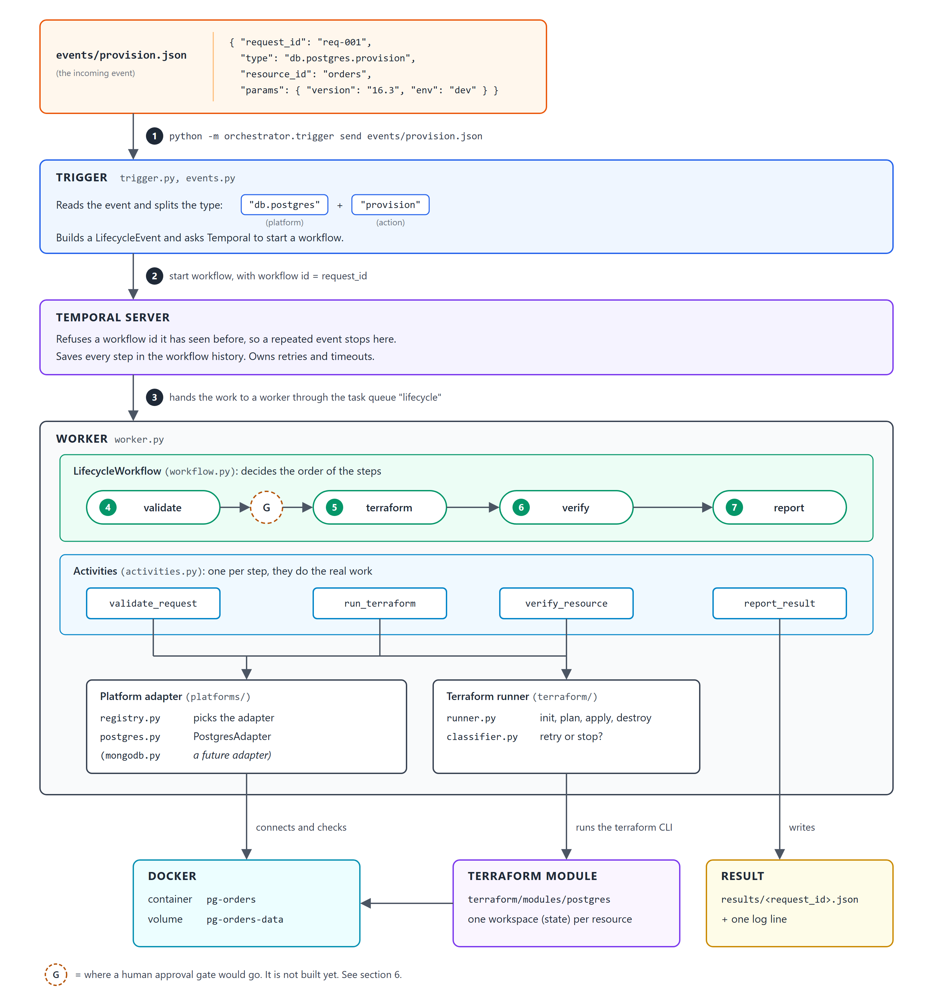

# Design: Event-Driven Infrastructure Orchestrator

This document explains what the system does, how it does it, and why it is built this way.

## 1. Overview

The system receives an **event** that asks for a change to a piece of infrastructure, for example "create a Postgres database" (`db.postgres.provision`). It then runs that change safely, checks that it worked, and reports the result.

Two tools do the heavy work:

- **Temporal** runs the steps in order, remembers how far it got, retries steps that fail, and keeps a full history of every run.
- **Terraform** makes the real change. In this project it creates a real Postgres container in Docker.

The rule that shapes the whole design is: **Temporal decides _when_ things happen, Terraform decides _how_ the change is made, and a small "platform adapter" holds everything that is specific to one platform** (Postgres today).

### Architecture diagram

The numbered circles 1 to 7 show the order of the flow. The rest of this document refers back to them as `[1]` to `[7]`, and to the approval gate as `(G)`.



**G** marks where a human approval gate would go. It is not built yet. See section 6.

### Walking through the diagram

1. **`[1]` An event arrives.** The trigger is a small command-line tool that stands in for a real event bus. It reads a JSON file from `events/`.
2. **`[2]` The trigger starts a workflow.** It splits the event type on the last dot: everything before it is the platform (`db.postgres`), the last part is the action (`provision`, `patch` or `decommission`). The `request_id` of the event becomes the workflow id.
3. **`[3]` Temporal gives the work to a worker.** The worker is a long-running Python process that holds the workflow code and the activity code.
4. **`[4]` Validate.** Reject a request that cannot succeed, before anything is changed.
5. **`[5]` Terraform.** Make the change: `apply` for provision and patch, `destroy` for decommission.
6. **`[6]` Verify.** Check the real resource, not just Terraform's word for it.
7. **`[7]` Report.** Write the final result to a file and to the log.

**Workflow and activities.** The workflow only knows the order of the four steps, their retry rules and their timeouts. It never mentions Postgres and never checks which action it is running. Each step is an **activity**: a normal Python function that is allowed to touch the outside world (run Terraform, open a database connection, write a file). Temporal requires this split, because workflow code must be repeatable and activity code is where failures and retries happen.

**Platform adapter.** Each activity looks up the adapter for the event's platform in the registry and asks it the platform-specific questions. The same four steps therefore mean different things for different actions:

| Step            | Provision                                                                       | Patch                                                                                       | Decommission                                    |
| --------------- | ------------------------------------------------------------------------------- | ------------------------------------------------------------------------------------------- | ----------------------------------------------- |
| `[4]` validate  | Version is well formed. The resource does not already exist at another version. | The resource exists. No downgrade. No major version change.                                 | Resource id is well formed.                     |
| `[5]` terraform | `apply`: create image, volume and container.                                    | `apply`: replace the container with the new version. The data volume and the port are kept. | `destroy`: remove the container and the volume. |
| `[6]` verify    | Connect to Postgres and check the version it reports.                           | Same check, with the new version.                                                           | Ask Docker and confirm the container is gone.   |
| `[7]` report    | Result file and log line.                                                       | Same.                                                                                       | Same.                                           |

**Terraform runner.** One Terraform module serves every Postgres instance. Each instance gets its own Terraform **workspace** (`pg-<resource_id>`), so the state of one database never mixes with another. The runner always runs `plan` first. If the plan is empty it applies nothing and reports `changed: false`.

**Final status.** Every run ends in one of three states:

| Status                | Meaning                                                                                  |
| --------------------- | ---------------------------------------------------------------------------------------- |
| `COMPLETED`           | The change was made (or was already in place) and the check passed.                      |
| `FAILED`              | Validation or Terraform failed. If Terraform failed, the resource may be partly changed. |
| `VERIFICATION_FAILED` | Terraform succeeded but the check at `[6]` did not pass.                                 |

While a workflow is running, `python -m orchestrator.trigger status <request_id>` shows the current step.

## 2. Assumptions made

Each one is a place where a real deployment could differ.

**About the environment**

- **Docker is the Terraform provider, not the `local` file provider.** A real container means the verify step at `[6]` can really fail, so the partial-failure path is real and testable. The cost is that the reviewer needs Docker running.
- **Everything runs on one machine.** The Temporal dev server, one worker, Terraform and Docker are all local. Terraform state is kept on the worker's local disk.

**About events**

- **The event type always looks like `<platform>.<action>`**, and there are exactly three actions: `provision`, `patch`, `decommission`.
- **The event source sends a stable `request_id`.** If the same event is delivered twice, it carries the same `request_id` both times. A new request gets a new id.
- **`resource_id` is unique within a platform.** It names the container, the volume and the Terraform workspace.

**About changes**

- **Every change can be done with one Terraform `apply` or `destroy`.** This holds for databases. It does not hold for desktop patching (see section 3).
- **A patch is a minor version bump inside the same major version** (16.3 to 16.4). A major upgrade is rejected because it needs `pg_upgrade`, and a downgrade is rejected.
- **A patch may cause a short downtime.** The container is replaced. There is no standby and no maintenance window.
- **A failed change is never undone automatically.** The resource may already hold data, and the fault may be in the check and not in the resource.
- **An unknown Terraform error is treated as temporary.** It is retried a few times and then shown to a person.

**About secrets and reporting**

- **The database password is created by Terraform and lives only in Terraform state.** It is never passed through the workflow, so it never appears in Temporal history, in the result file or in the repository.
- **"Notification" is a log line and a result file.** No paging or ticketing tool is connected.
- **`env` is only a label today.** It is recorded on the container but does not change behaviour. It is the hook the approval gate would use (section 6).

## 3. How the current approach generalizes beyond Postgres

### The choice: one workflow, with a pluggable adapter per platform

| Option                                           | Verdict                                                                                                                                                                                                                      |
| ------------------------------------------------ | ---------------------------------------------------------------------------------------------------------------------------------------------------------------------------------------------------------------------------- |
| **One workflow, pluggable adapter per platform** | **Chosen.** The steps `[4]` to `[7]` are the same for every platform. Only their meaning differs. Retries, partial-failure handling, status and duplicate protection are written once and every platform gets them for free. |
| One workflow per platform                        | Each platform would copy the same failure handling. Over time the copies drift apart, and a fix made in one is missed in the others.                                                                                         |
| One workflow per action                          | Provision, patch and decommission already share one sequence. The thing that changes is the platform, not the action.                                                                                                        |

In the diagram, this choice is the reason the "Platform adapter" box is the only box with a platform name in it. Everything above it is shared.

### Example: adding MongoDB

Nothing in the workflow, the activities, the trigger or the Terraform runner changes. You add two things and one line:

```
terraform/modules/mongodb/          new   the Terraform module (main.tf, variables.tf, outputs.tf)
orchestrator/platforms/mongodb.py   new   the MongoAdapter class
orchestrator/platforms/registry.py  edit  one line: register(MongoAdapter())
```

`MongoAdapter` fills in the same contract that `PostgresAdapter` does. The contract is defined in `platforms/base.py`:

| What the adapter provides  | What it would be for MongoDB                                                                     |
| -------------------------- | ------------------------------------------------------------------------------------------------ |
| `resource_type`            | `"db.mongodb"`. This is how events are routed to it.                                             |
| `module_dir`               | The path to `terraform/modules/mongodb`.                                                         |
| `workspace(event)`         | A state name per instance, for example `mongo-<resource_id>`.                                    |
| `validate(event, current)` | The rules for a valid request: version format, no downgrade, resource must exist before a patch. |
| `tf_vars(event, current)`  | The input variables for the Mongo module.                                                        |
| `verify(event, outputs)`   | Connect with a Mongo client and check the server version. For decommission, check it is gone.    |
| `public_outputs(outputs)`  | The outputs that are safe to report, with the password removed.                                  |

Once it is registered, an event of type `db.mongodb.provision` finds its own way: at `[2]` the trigger reads the platform as `db.mongodb`, and at `[4]` the registry returns `MongoAdapter`.

This is tested. `tests/workflows/test_pluggability.py` registers a made-up platform and runs the unchanged workflow against it with real Terraform.

### Where the design stops: Windows desktop patching

The current core assumes that step `[5]` is always one Terraform `apply` or `destroy`. Patching a Windows desktop does not fit that. It is usually done with a tool like Ansible, and it needs more steps: pre-checks, install patches, reboot, wait for the machine to come back.

I would still keep the single workflow, and widen the adapter contract in two ways:

- **The adapter owns the "change" step.** It says which tool makes the change: Terraform for databases, an Ansible playbook for patching. Both give back the same answer (changed or not, plus the safe outputs), so the workflow does not care which one ran.
- **The adapter can list extra steps** (for example "reboot" and "wait for host"). The workflow runs them in order, under the same retry and failure handling as the built-in steps.

## 4. How partial failures are handled

A **partial failure** is when one step succeeds and a later step fails, so the system is left somewhere in the middle. The main case is: Terraform at `[5]` succeeds, but verification at `[6]` fails.

### How failures are handled today

Every failure is first sorted into "retry" or "stop". This is decided below the Temporal layer, and one function (`translate_errors` in `activities.py`) passes the decision on to Temporal.

| Step  | Failure              | Example                                               | What happens                                                                                                                  |
| ----- | -------------------- | ----------------------------------------------------- | ----------------------------------------------------------------------------------------------------------------------------- |
| `[4]` | Invalid request      | Patch a database that does not exist. Downgrade.      | Stops at once. Waiting cannot fix it.                                                                                         |
| `[5]` | Terraform, permanent | Bad variable, name already in use, unknown image tag. | Stops at once. A person must act.                                                                                             |
| `[5]` | Terraform, temporary | State lock held, Docker or registry hiccup.           | Up to 4 attempts, starting 10 seconds apart. Safe, because Terraform moves towards the wanted state and does not repeat work. |
| `[6]` | Verification         | Database not accepting connections yet.               | Retried for about a minute. After that it is not "still starting", it is wrong.                                               |
| `[7]` | Reporting            | Cannot write the file.                                | Up to 10 attempts. Losing the report would hide the outcome.                                                                  |

**When Terraform succeeds and verification fails**, the workflow does three things:

1. **It does not undo the change.** The database may already hold data, and the problem may be in the check and not in the database.
2. **It records its own status, `VERIFICATION_FAILED`.** This is different from `FAILED`, so the operator can tell "nothing was changed" from "changed, but not confirmed".
3. **It still runs the report step `[7]`, then ends the workflow as failed.**

**What the operator sees:**

- In the Temporal UI, the workflow is shown as **Failed**, with the failure type `VERIFICATION_FAILED`.
- A result file `results/<request_id>.json` and a log line. Both say what was applied, why the check failed, and that the resource was left in place.
- A way forward: fix the cause, then send the same event again with a new `request_id`. Terraform finds nothing to change, and the verify step runs again.

You can try this path with `events/patch-verify-fails.json`, which makes the check fail on purpose after a real patch.

**The other partial failure** is Terraform itself failing half-way through step `[5]`, for example the volume is created but the container is not. The workflow ends as `FAILED` with the note "the resource may be partly changed". Sending the event again finishes the work, because Terraform only creates what is missing.

### How I would improve it

- **Pause instead of fail.** On a verification failure, the workflow would wait for a person to choose: check again, accept, or roll back. This keeps the decision in the same workflow as the change. Section 6 describes it.
- **Collect evidence automatically.** Add the container logs and health status to the result, so the operator does not have to go and find them.
- **Alert a person.** Send `VERIFICATION_FAILED` to a ticketing tool. Today somebody has to look at the file or the UI.
- **Notice a dead worker sooner.** If the worker dies during step `[5]`, Temporal only notices after the 15-minute timeout. Activity heartbeats would cut that to seconds.

## 5. How the system prevents duplicates

The danger is that one event is delivered twice and two databases are created, or one database is changed twice. There are two guards, at two different places in the diagram.

### Guard 1, at `[2]`: the same event delivered twice

The `request_id` is used as the Temporal workflow id, and the workflow is started with the policy `REJECT_DUPLICATE`. Temporal refuses to start a second workflow with an id it has already seen, whether the first one is still running or has finished. The trigger prints "duplicate: nothing started" and nothing else happens.

### Guard 2, at `[4]` and `[5]`: the same request under a new `request_id`

Here a second workflow does start, so the protection has to be in the work itself:

- **Validation `[4]`** rejects a provision for a resource that already exists at a different version. The same version is allowed through on purpose, so that a provision that failed half-way can be finished by sending it again.
- **Terraform `[5]`** plans first. If the resource is already in the wanted state, the plan is empty and nothing is applied. Because each resource has its own workspace, a second request for `orders` always meets the state of the first one.
- **The result is honest.** The workflow returns `COMPLETED` with `changed: false` and the text "provision needed no changes; current state verified". It never claims to have applied something it did not.

A repeated decommission works the same way: there is nothing left to destroy, the check confirms the container is gone, and the result says no changes were needed.

### How I would make it stronger with more time

- **A lasting record of handled requests.** Guard 1 only works for as long as Temporal keeps the finished workflow (its retention period). A small table of handled request ids would make it permanent.
- **Do not depend on the sender.** Guard 1 needs the event source to send the same `request_id` on a redelivery. If it cannot promise that, the intake can build the id itself from the content of the event (platform, resource, action, parameters).
- **Remote state with locking.** With local state, two workers on two machines would not see each other's lock. A shared backend with locking closes this gap.

## 6. Where human gating is needed

Nothing in this section is built. It describes where it fits and how it would work.

### The approval gate: `(G)` in the diagram

The gate sits **between validate `[4]` and terraform `[5]`**:

- **After validation**, so nobody is asked to approve a request that cannot succeed anyway.
- **Before Terraform**, so nothing has changed while the workflow waits.

The adapter decides which requests need approval, with a new method such as `requires_approval(event)`. For Postgres this would be: a decommission where `env` is `prod`. Keeping this in the adapter means the workflow still knows nothing about any platform.

How it would work:

1. The workflow runs `terraform plan -destroy`, so the approver can see exactly what would be removed.
2. It sets its status to `AWAITING_APPROVAL` and notifies the approvers.
3. It waits for a **Temporal signal**: `approve` or `reject`. Waiting costs nothing. No worker is held, and the wait survives a worker restart.
4. **On approve:** it validates again (the resource may have changed while waiting) and continues to `[5]`.
5. **On reject, or no answer in 24 hours:** it ends as `REJECTED` or `EXPIRED` with nothing changed. A request to destroy a database that nobody answered must never go ahead.

The signal and the approver's name are saved in the workflow history, next to the change they allowed. Since anyone who can send the signal can approve, signals should come from an approval service that checks who the approver is, what role they have, and that they are not the person who made the request.

### Rollback

**How the system deals with it today.** There is no rollback path.

- A patch to a lower version is rejected at validation `[4]`, so a rollback cannot be requested by sending a "patch back" event.
- When verification `[6]` fails after a patch, the resource is left on the new version and the run ends as `VERIFICATION_FAILED`.
- The operator's options are to fix the cause and send the event again, or to repair the resource by hand outside the orchestrator.

Automatically reverting a database that holds data is a risky change in its own right, and it should not happen without a person agreeing to it.

**How I would build it.** Rollback would be a human decision, using the same signal mechanism as the approval gate. This is a second gate, placed **after verify `[6]`**:

1. Before a patch, the workflow records the current version.
2. If verification fails, the workflow does not fail. It pauses with status `AWAITING_DECISION` and notifies the operator.
3. It waits for one of three signals:
   - `retry_verify`: the cause was outside the database and is now fixed. Run the check again.
   - `accept`: the check itself was wrong. Finish as completed.
   - `rollback`: apply the recorded previous version, then verify again.
4. If the rollback also fails, the workflow stops as `ROLLBACK_FAILED` and tries nothing more. A person takes over.

**A decommission cannot be rolled back**, because `destroy` removes the data volume. That is exactly why it gets approval _before_ it runs and not a decision after. Two additions would make it recoverable: a backup step before the destroy, and a two-stage destroy (stop the container first, remove the volume only after a waiting period).

## 7. What I would add for production

1. **Authentication and authorization.** Today, anyone who can reach the Temporal server can start a decommission. Add an event intake that checks who the caller is, mTLS between the trigger, the server and the workers, and role checks on who may request and who may approve. Encrypt the event data stored in workflow history.
2. **Monitoring and real notification.** Metrics for outcomes, retries and step duration. Alerts on `VERIFICATION_FAILED` and on workflows that are stuck. Search attributes (resource, environment, action, tenant) so runs can be found in the Temporal UI. Results sent to paging and ticketing tools instead of a file.
3. **Remote state and real secret handling.** State is on the worker's local disk and holds the database password in plain text. Move it to a remote backend with locking and encryption, and let a secret manager create and hand out the credentials.
4. **Drift detection.** A change made by hand is found only when the next event arrives. A scheduled `terraform plan` per resource would find and report it.
5. **Multi-tenancy.** Give each team or business unit its own Temporal **namespace**, so their workflows, history and permissions are separate. Add a tenant field to the event and include it in the resource name and the Terraform workspace, so two teams can both own a database called `orders`. Give each tenant its own state backend and its own worker credentials, so one team's worker cannot touch another team's infrastructure. Use a task queue per tenant or per platform, with limits, so one busy team cannot starve the others.
6. **Stronger workers.** Heartbeats and cancellation on the Terraform activity, more than one worker, and workflow versioning so new code can be deployed while old workflows are still running.
